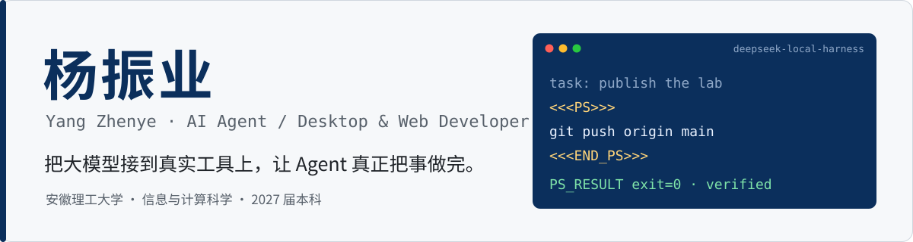

<picture>
  <source media="(prefers-color-scheme: dark)" srcset="assets/header-dark.svg">
  
</picture>

<b>求职方向</b>　AI Agent 开发 · Electron 桌面开发 · Web 开发与维护 
<b>联系邮箱</b>　13339189151xyz@gmail.com 
<b>个人站点</b>　<a href="https://mirror.xyzcxcc.cloud">mirror.xyzcxcc.cloud</a>

我主要做一件事：把大模型接到**真实工具和本地系统**上，包括 PowerShell、浏览器、Windows 桌面和 Web 服务，并且用最终状态来判断任务是否完成，而不是“工具调用返回成功”。

## 代表项目

<table>
<tr>
<td width="50%" valign="top">

### [DeepSeek Local Harness](https://github.com/3192673546/deepseek-local-harness)

Python · Electron · PowerShell · MCP

Windows 本地 AI Agent 桌面应用。设计了一个极小的文本协议 `<<<PS>>>`，让没有原生 Function Calling 的模型也能驱动本地 PowerShell：严格解析完整响应，交给受监督的执行器运行，再把结果回写到同一会话。

**v1.0.0** 一键安装包已发布，用户不用另装 Python / Node

</td>
<td width="50%" valign="top">

### [Windows Agent MCP Lab](https://github.com/3192673546/windows-agent-mcp-lab)

Python · Node.js · CDP · Windows UIA · ConPTY

自建浏览器、桌面、编码三类 MCP 工具服务，重点在状态失效、fail-closed 安全拒绝和回归测试，并通过 OpenAI Secure MCP Tunnel 接入 ChatGPT 连接器。

**Browser MCP 12/12 · Computer Use 8/8** 自测通过

</td>
</tr>
<tr>
<td width="50%" valign="top">

### [Writing Desktop](https://github.com/3192673546/writing)

Electron · Node.js · Express · MathJax

开源 Markdown / LaTeX 编辑器的桌面化二次开发：做了 EXE 打包、`.md` 文件关联、本地文档库和公式预览防闪烁，并修复了公式占位符泄漏问题。

**自动化测试** 覆盖渲染规则、预览截图、API 与真实 UI 点击

</td>
<td width="50%" valign="top">

### [计算机考研杂货铺](https://github.com/3192673546/csgraduates-static-mirror)

Nginx · Cloudflare · Linux

独立开发并持续运营的 408 学习资料站。采用版本化 release、符号链接原子切换发布，上线前后都做冒烟测试和公网验证，并保留上一版本以便回滚。

**线上运行中** · [mirror.xyzcxcc.cloud](https://mirror.xyzcxcc.cloud)

</td>
</tr>
</table>

## 做事方式

- **Observe → Act → Verify**：写操作之前先重新观察，操作之后再次确认状态。
- **Fail closed**：窗口、焦点、页面状态对不上时直接拒绝执行，不盲目重试。
- **以证据判定完成**：进程启动、点击送达都不等于任务完成，要看最终结果。

## 技术栈

| 方向 | 技术 |
|---|---|
| AI / Agent | Agent Loop · Tool Calling · MCP · Computer Use · CDP · Windows UIA |
| 桌面 | Electron · PowerShell · electron-builder / NSIS · PyInstaller · ConPTY |
| Web | JavaScript · Vue 3 · Express · Flask · Spring Boot · REST API |
| 数据与部署 | SQLite · MySQL · Cloudflare Workers / D1 / R2 · Nginx · Docker · Linux |

## 其他项目

- [交谊舞曲平台](https://github.com/3192673546/Ballroom-dance-music)：Vue 3 + Express + SQLite 全栈音乐站，用 FFmpeg 自动截取试听片段，JWT 鉴权
- [题库工作台](https://github.com/3192673546/question-bank)：Flask + SQLite + KaTeX，管理题目、试卷与知识点大纲
- [Freemail](https://github.com/3192673546/mailfree-app)：在 Cloudflare Workers / D1 / R2 上部署和维护临时邮箱服务
- [学生管理系统](https://github.com/3192673546/student-management)：Spring Boot + MyBatis + Thymeleaf 练习项目

<b>English</b>

 

**Yang Zhenye** — Information & Computing Science, Anhui University of Science and Technology (class of 2027). I build AI agents that operate real tools — PowerShell, browsers, the Windows desktop and web services — and judge success by verified end state rather than a tool call returning "ok".

- **[DeepSeek Local Harness](https://github.com/3192673546/deepseek-local-harness)** — Windows desktop agent; a tiny `<<<PS>>>` text protocol lets models without native function calling drive a supervised PowerShell runner. v1.0.0 installer released.
- **[Windows Agent MCP Lab](https://github.com/3192673546/windows-agent-mcp-lab)** — browser, desktop and coding MCP servers with stale-state prevention, fail-closed checks and regression tests; connected to ChatGPT via OpenAI Secure MCP Tunnel.
- **[Writing Desktop](https://github.com/3192673546/writing)** — Electron packaging and engineering for an open-source Markdown / LaTeX editor, with automated rendering and UI tests.
- **[CS study site](https://mirror.xyzcxcc.cloud)** — a live site I build and run, with versioned releases, atomic switching and rollback.

